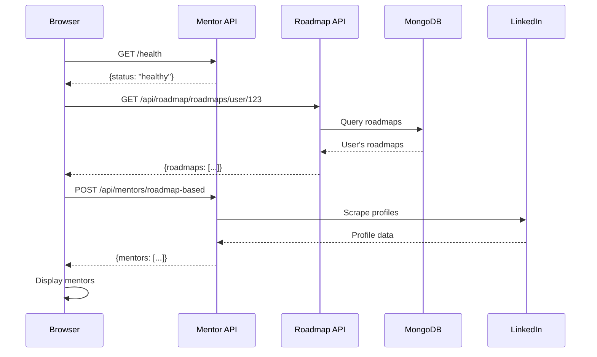

# 🚀 Start Complete System - Quick Guide

## The Problem

You're seeing **only `/health` calls** because:

1. ✅ Mentor Service is running (Port 8004)
2. ❌ **Roadmap API is NOT running (Port 8001)**
3. ❌ Frontend can't fetch roadmap from MongoDB
4. ❌ Never reaches the mentor API call

## The Solution - Start All Services

You need **4 services** running simultaneously:

### Terminal 1: MongoDB
```bash
mongod
```
Wait for: `waiting for connections on port 27017`

### Terminal 2: Roadmap API ⚠️ **MISSING - START THIS!**
```bash
cd roadmap_api
python main.py
```
Wait for: `Uvicorn running on http://0.0.0.0:8000`

### Terminal 3: Mentor Service ✅ (Already Running)
```bash
cd mentor_recommendation_service
python main.py
```
Wait for: `Uvicorn running on http://0.0.0.0:8004`

### Terminal 4: Frontend
```bash
cd dashboard
npm run dev
```
Wait for: `Local: http://localhost:5173`

## OR Use Batch File (Windows)

```bash
start_complete_mentor_system.bat
```

This opens all terminals automatically!

## Verify Services

### Check Roadmap API (Port 8000) ⚠️
```bash
curl http://localhost:8000/health
```
**Expected:**
```json
{"status":"healthy","service":"roadmap-api","database":"connected"}
```

### Check Mentor API (Port 8004) ✅
```bash
curl http://localhost:8004/health
```
**Expected:**
```json
{"status":"healthy","timestamp":"2025-10-16T..."}
```

### Check MongoDB ⚠️
```bash
mongosh
use pathwise
db.roadmap.countDocuments()
```

## Complete Test Flow

### Step 1: Test with Test File
```bash
# Open in browser:
test_mentor_api_directly.html
```

**Click buttons in order:**
1. **Test Roadmap API** - Should work after starting port 8001
2. **Test Mentor Service Health** - Should show healthy
3. **Save Test Roadmap to MongoDB** - Creates a test roadmap
4. **Test Mentor API** - Should scrape mentors

### Step 2: Test in Real UI

**A. Create Roadmap:**
1. Go to http://localhost:5173/roadmap
2. Click "Generate Roadmap"
3. Enter: "Become a React Developer"
4. Click Generate
5. **Verify:** Roadmap shows with steps

**B. View Mentors:**
1. Go to http://localhost:5173/mentors
2. **Should see:**
   - Loading spinner
   - After 30-60 seconds: Mentor cards
   - Green badges on real LinkedIn profiles

**C. Check Browser Console (F12):**
```
🔍 Fetching roadmap from MongoDB for user: ...
✅ Found roadmap in MongoDB: {goal: "...", domain: "..."}
🔍 Fetching mentors for: {...}
✅ Received mentors: {...}
```

## What Happens When It Works



## Current vs Fixed State

### ❌ Current (What You Have)
```
✅ MongoDB: ?
❌ Roadmap API (8000): NOT RUNNING
✅ Mentor API (8004): Running
✅ Frontend (5173): Running

Result: Only /health calls, no mentors
```

### ✅ Fixed (What You Need)
```
✅ MongoDB: Running on 27017
✅ Roadmap API (8000): Running
✅ Mentor API (8004): Running  
✅ Frontend (5173): Running

Result: Full flow works, mentors displayed
```

## Quick Checklist

- [ ] MongoDB running on port 27017
- [ ] Roadmap API running on port 8000 ⚠️ **START THIS**
- [ ] Mentor API running on port 8004 ✅
- [ ] Frontend running on port 5173
- [ ] At least one roadmap created for the user
- [ ] Browser console shows no errors

## Start Right Now

**Open 4 terminals and run these commands:**

```bash
# Terminal 1
mongod

# Terminal 2 - THE MISSING ONE!
cd roadmap_api
python main.py

# Terminal 3
cd mentor_recommendation_service  
python main.py

# Terminal 4
cd dashboard
npm run dev
```

**Then:**
1. Go to http://localhost:5173/roadmap
2. Generate a roadmap
3. Go to http://localhost:5173/mentors
4. Watch the magic happen! 🎉

## Why This Matters

The mentor page flow:
1. Checks mentor service health (`/health`) ✅
2. **Fetches roadmap from MongoDB (needs port 8000)** ❌ **YOU'RE STUCK HERE**
3. Calls mentor API with roadmap data
4. Displays mentors

You're stuck at step 2 because the Roadmap API isn't running!

Start it, and the full flow will work! 🚀

